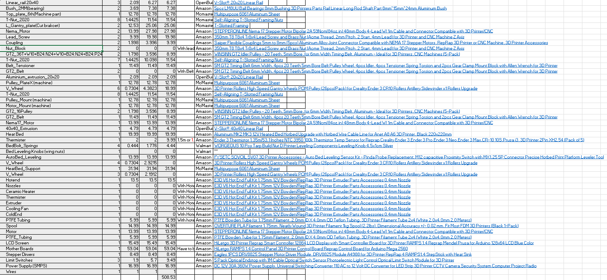

What is my project?
    I am creating a basic 3D printer that will move in 3 axies of x, y, and z and also extrude PLA filament. This 3D printer uses NEMA 17 motors and can extrude 1.75 diameter of filament and the build plate is 220mm by 220mm.

Why am I making a 3D Printer?
    I wanted to learn more about the STEM field and I wanted to use what I learned during my time at robotics. I used to design few things but did not have a 3D printer to bring it to life so I decided to make one myself to not only learn all about them but also feel the satisfication of making my own 3D printer. I also wanted to design a project that I would use in my daily life so I decided I could make this 3D printer.

